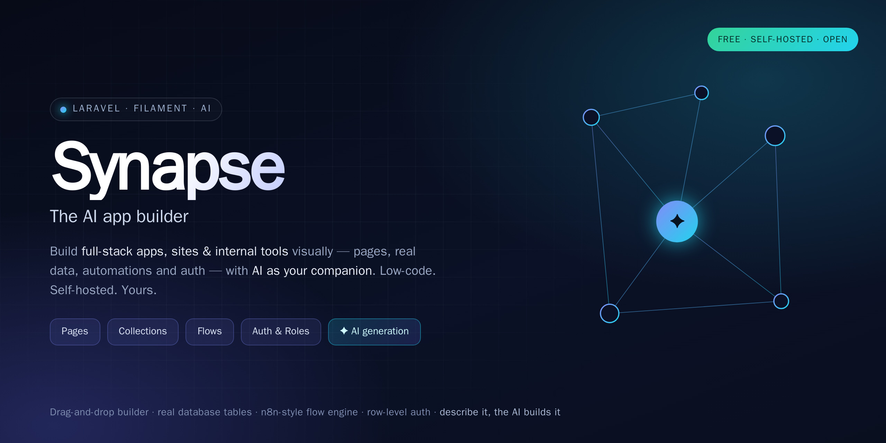
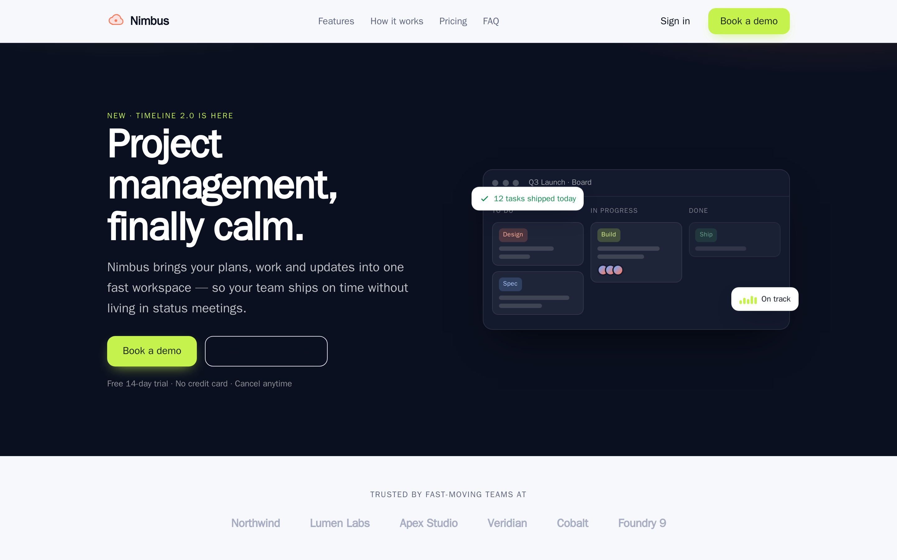
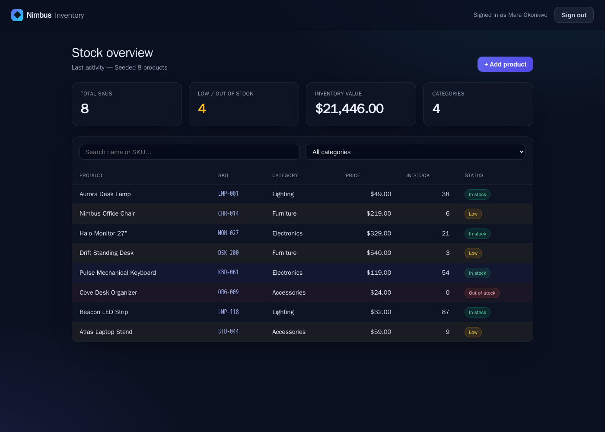
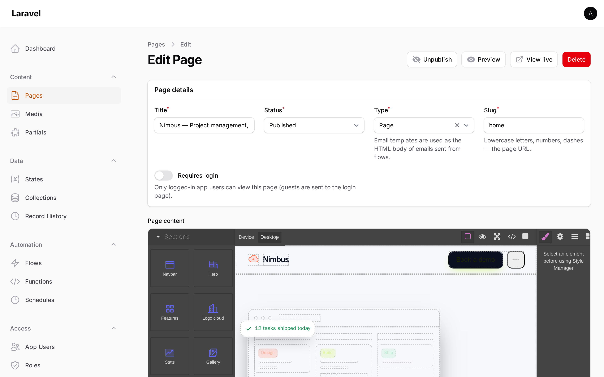
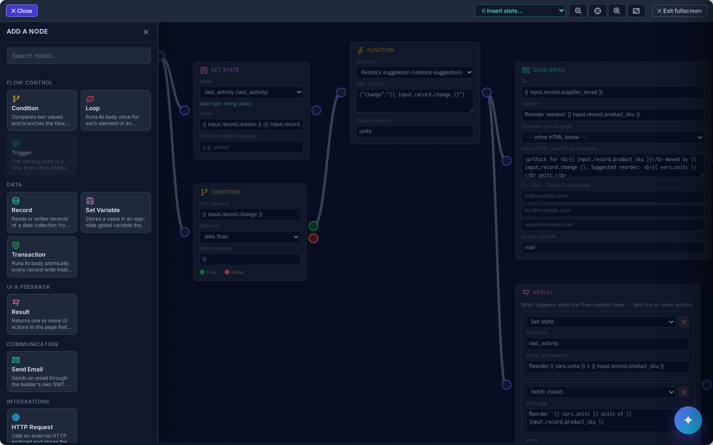
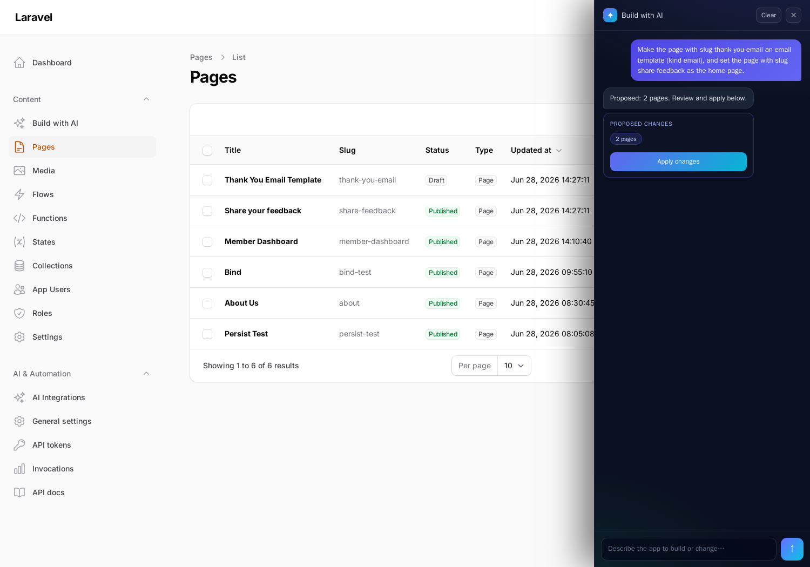
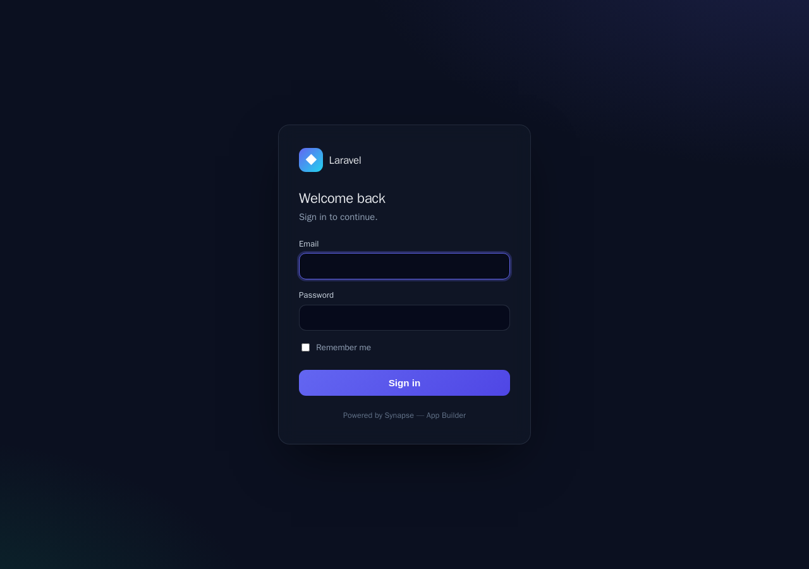
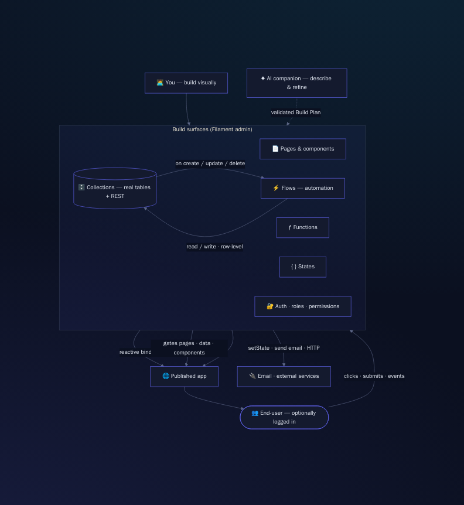

<p align="center">
  
</p>

<h1 align="center">Synapse — App Builder</h1>

<p align="center">
  <strong>A data-driven app builder that lives inside your own Laravel + Filament admin.</strong><br>
  Visual pages, typed data + an instant REST API, an n8n-style flow engine, end-user auth (SSO/2FA) and external data — configurable on the fly. <strong>Drops into an existing Laravel app as a package and lives alongside it, no clash.</strong> AI is an optional accelerator that builds and refines for you. Free, MIT, entirely self-hosted.
</p>

<p align="center">
  <a href="https://synapse-app.site"><strong>Website</strong></a> ·
  <a href="https://synapse-app.site/docs/">Documentation</a> ·
  <a href="#quick-start">Quick start</a> ·
  <a href="#what-you-can-build">What you can build</a> ·
  <a href="#the-ai-layer">The AI layer</a>
</p>

---

## Why Synapse

Building an internal tool, a SaaS UI, or a marketing site usually means stitching together a CMS, a database admin, a workflow tool, an auth system and a front-end — then wiring them all up by hand.

**Synapse is all of that, in one package, inside the Laravel + Filament admin you already run.** Drag pages together, define your own data tables, wire automations that react to clicks and data changes, gate it behind your own users and roles — and when you'd rather just *say what you want*, the built-in AI generates the whole thing and keeps refining it as you chat.

**It lives *alongside* your existing app.** Synapse is a package, not a platform: its tables are prefixed (`page_builder_*` / `pb_<key>`), it registers its **own** end-user auth guard without touching yours, its admin UI is an **opt-in** Filament plugin, and its routes defer to your app's (it never claims `/`). Drop it into a Laravel app you already run and it coexists — no clash, fully configurable (connection, table names, guard, routes, models are all overridable).

Nothing leaves your server. There's no SaaS, no per-seat pricing, no lock-in. It's MIT-licensed and yours.

> **You bring the idea. Synapse brings the pages, the database, the logic, the login screen — and an optional AI that builds alongside you.**

---

## What's inside

| Pillar | What it gives you |
|---|---|
| 🧩 **Pages & components** | A GrapesJS visual builder + a real UI kit (cards, modals, drawers, tabs, forms, **data tables**), per-page CSS/JS, SEO, a cached public render route, and a pickable **home page**. **Management pages** give you an Add form + live data table + per-row Edit/Delete in one pattern. Image fields upload on select via a gated `/pb-upload` endpoint. |
| 🗄️ **Collections (data)** | Define your own models → **real database tables** (`pb_<key>`, Directus-style) with typed fields, schema sync, an instant **REST API** (filter/sort/search/paginate/`expand=*`) and a records browser. `?expand=*` resolves belongs-to relations so lists show related record names instead of raw ids. Or map an **existing external table** as a read-through virtual collection — same API/blocks/flows, never schema-managed. |
| ⚡ **Flows (the brain)** | An n8n-style visual canvas. Transaction and Loop bodies are edited as an ordered, sortable **step list**. A **`call_flow`** node runs a saved flow as a sub-step, sharing context. One Trigger per flow (START-badged), enforced by the editor. **Colour-coded node types** (with a matching, colour-coded node drawer), **green / red true / false branch ports** on conditions, zoom controls + non-overlapping auto-layout. Nodes: CRUD, HTTP, AI invoke, functions, conditions, set-state, **send email**, page actions — with a low-code **Result** type-picker. |
| ƒ **Functions & States** | Reusable logic (expression / callable / PHP) and a persistent, app-wide **reactive store** that components bind to and flows update live. Factor a one-liner into a Function; a multi-step process into a reusable Flow via `call_flow`. |
| 🔐 **Auth & permissions** | The built app's **own** users, roles and permissions — sign in once, every gated page just works. Password / **SSO** (Google · Microsoft · GitHub, org-restricted) / **2FA** (email-OTP + authenticator), self-registration + email **invites**, per-page gating, opt-in CRUD rules, **row-/field-level security** and record ownership. Optional: a public site ignores it entirely. |
| ✉️ **Email** | An isolated SMTP transport (configured in Settings) + a `send_email` flow node that uses any page as an interpolated **email template**. |
| ✦ **AI generation** | Describe an app in plain language → review a validated plan → apply it. The generator composes reusable functions and flows instead of repeating logic. A **floating chat** follows you across the admin to refine what you've built. Backed by a **generation quality harness** that asserts every layer of a generated app. Powered by the [AI OpenRouter Gateway](https://github.com/andrecorugda/ai-openrouter-gateway). |

---

## See it

Everything below was **built with the package itself** — run `php artisan ai-page-builder:install-demo` to get the marketing site and the role-gated Inventory app, then sign in and explore.

| A designed marketing site | A role-gated Inventory app — live data, KPIs, search & CRUD |
|---|---|
|  |  |

| The visual builder — drag typed, colour-coded blocks | The flow canvas — colour-coded nodes + true / false branches |
|---|---|
|  |  |

| Describe it; AI returns a reviewable Build Plan | The app's own sign-in (password · SSO · 2FA) |
|---|---|
|  |  |

---

## What you can build

- **An internal CRUD tool** — define collections, use the management page pattern (Add form + data table + per-row Edit/Delete), gate it behind a login with per-role, row-level access (users see only their own rows). Relation columns resolve names automatically.
- **A lead-capture or feedback site** — a public page whose form writes straight into a collection, with a flow that emails a templated confirmation on every submission.
- **A reactive dashboard** — components bound to live state, updated by flows as data changes, no page reload.
- **A marketing site** — pick a home page, design freely, publish to a cached route.
- **…or just describe it** — *"a waitlist app that emails a welcome on signup and has a landing page"* → Synapse builds the collection, the page, the email template and the flow, and you tweak it from the chat.

---

## How it fits together

<p align="center">
  
</p>

**The loop in one line:** *event → flow → read/write data + set state → bound components re-render — and AI can build or change any of it.*

---

## Quick start

**Requirements:** PHP 8.2+ · Laravel 11/12/13 · Filament 4/5

```bash
composer require andrecorugda/synapse
php artisan vendor:publish --tag="ai-page-builder-migrations"
php artisan migrate
```

Register the plugin on your Filament panel:

```php
use Andre\AiPageBuilder\Filament\AiPageBuilderPlugin;

public function panel(Panel $panel): Panel
{
    return $panel->plugin(AiPageBuilderPlugin::make());
}
```

A **Content** group appears with Pages, Media, Flows, Functions, Collections, States, App Users, Roles and Settings. Create a collection, build a page, wire a flow, publish.

**To unlock AI generation**, install the gateway and add your OpenRouter key — the `app_builder` integration self-seeds:

```bash
composer require andrecorugda/ai-openrouter-gateway
# set OPENROUTER_INTEGRATION_KEY (or OPENROUTER_API_KEY) in .env
```

Then tap the ✦ chat orb on any admin page and just talk to it.

**Want a guided tour?** Install two ready-made apps (a marketing site + a role-gated Inventory CRUD app) built entirely from the package:

```bash
php artisan ai-page-builder:install-demo
```

📖 **Full documentation:** [`docs/`](docs/README.md) — installation, architecture, every subsystem, and the complete config reference.

---

## The AI layer

AI is **optional and additive** — the builder is fully usable by hand. When the [AI OpenRouter Gateway](https://github.com/andrecorugda/ai-openrouter-gateway) is installed:

- **A real conversation, with modes.** The floating chat talks like a teammate — **Auto** infers what you want, **Ask** answers only, **Plan** designs it with you, **Build** ships it. Greetings and questions get replies, not plans.
- **You describe; it plans — visibly.** When you ask for a change, it returns a structured **Build Plan** shown in full (each collection + its fields, pages, flows, settings) for review — never opaque files.
- **Applied as data.** A deterministic, idempotent engine writes the plan through the same services the admin uses, so AI-built artifacts behave exactly like hand-built ones — and "refine" just means re-applying a plan that references existing items.
- **A companion, not a wizard.** The chat is thread-aware and context-aware (it knows your collections, pages and flows); build on one page, refine on another.
- **Safe by construction.** AI-authored HTML is sanitized (declarative bindings kept, executable directives stripped); applying is always human-in-the-loop; generation is metered and cost-capped by the gateway.

---

## Self-hosting front-end assets (offline / air-gapped)

The editor loads GrapesJS, Drawflow, Alpine and Ace from a CDN by default (zero-config). For offline / strict-CSP installs, vendored copies ship in the box:

```bash
php artisan vendor:publish --tag="ai-page-builder-assets"
# → public/vendor/ai-page-builder/{grapesjs,drawflow,alpine,ace}/
```

Point the asset env vars at the published copies (see [`docs/installation.md`](docs/installation.md)). `AI_PAGE_BUILDER_ACE_BASE` must stay a **directory**.

---

## Testing & quality

```bash
composer test       # Pest
composer lint       # Pint
composer analyse    # PHPStan (larastan)
```

## Support

Synapse is free and MIT-licensed. If it's useful to you, you can support its
development:

<a href="https://ko-fi.com/G7S722N0L8" target="_blank"></a>

## License

MIT © Andre Corugda. See [LICENSE](LICENSE).
