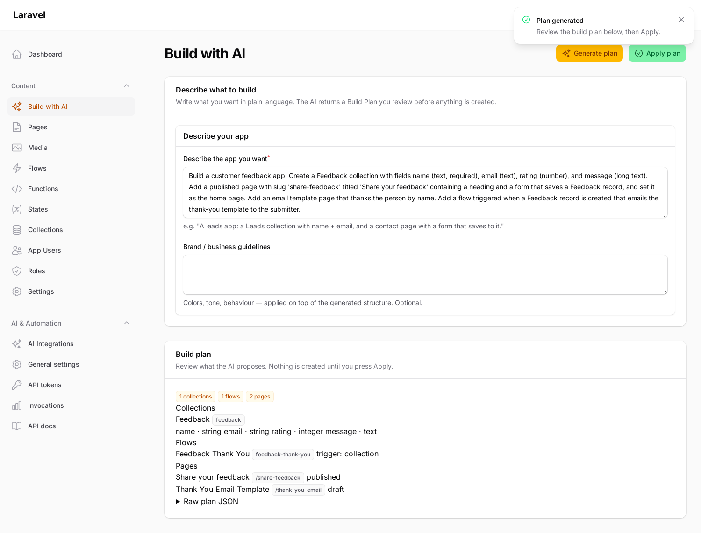
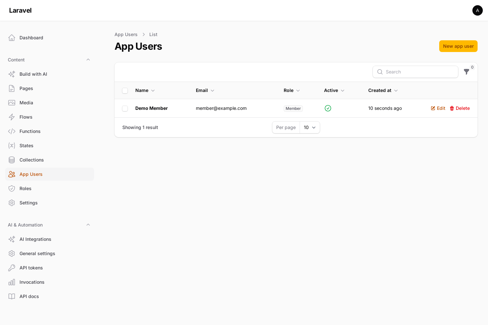
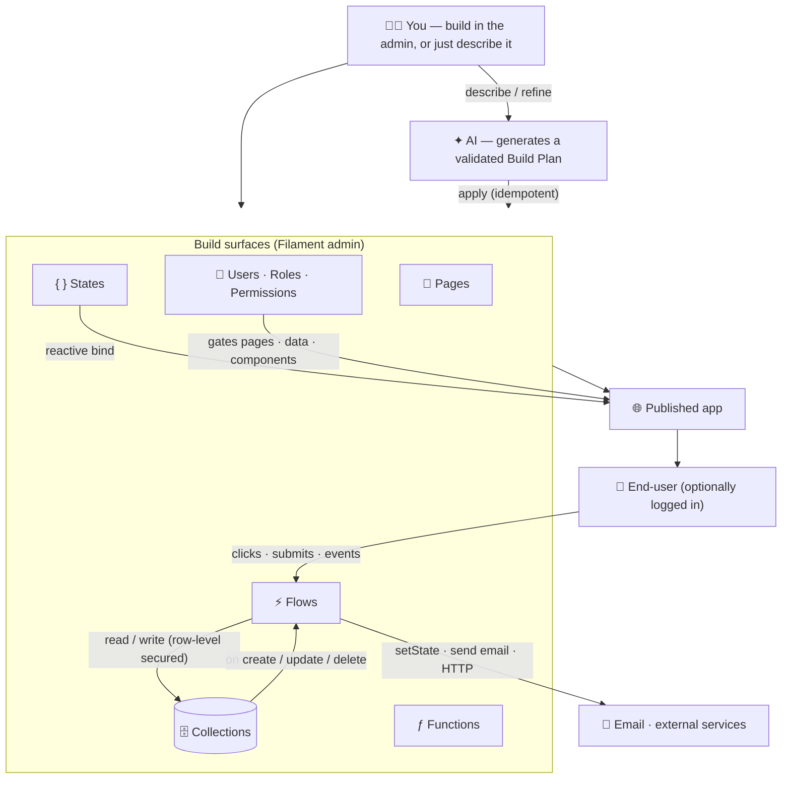

<p align="center">
  
</p>

<h1 align="center">Synapse — App Builder</h1>

<p align="center">
  <strong>Describe an app. Watch it get built. Then refine it by chatting.</strong><br>
  A full-stack, low-code app builder for Laravel + Filament — pages, real data, automations, auth and live UI — with AI as your companion. Free, open, and entirely self-hosted.
</p>

<p align="center">
  <a href="#quick-start">Quick start</a> ·
  <a href="docs/README.md">Documentation</a> ·
  <a href="#what-you-can-build">What you can build</a> ·
  <a href="#the-ai-layer">The AI layer</a>
</p>

---

## Why Synapse

Building an internal tool, a SaaS UI, or a marketing site usually means stitching together a CMS, a database admin, a workflow tool, an auth system and a front-end — then wiring them all up by hand.

**Synapse is all of that, in one package, inside the Laravel + Filament admin you already run.** Drag pages together, define your own data tables, wire automations that react to clicks and data changes, gate it behind your own users and roles — and when you'd rather just *say what you want*, the built-in AI generates the whole thing and keeps refining it as you chat.

Nothing leaves your server. There's no SaaS, no per-seat pricing, no lock-in. It's MIT-licensed and yours.

> **You bring the idea. Synapse brings the pages, the database, the logic, the login screen — and an AI that builds alongside you.**

---

## What's inside

| Pillar | What it gives you |
|---|---|
| 🧩 **Pages & components** | A GrapesJS visual builder + a real UI kit (cards, modals, drawers, tabs, forms, **data tables**), per-page CSS/JS, SEO, a cached public render route, and a pickable **home page**. |
| 🗄️ **Collections (data)** | Define your own models → **real database tables** (`pb_<key>`, Directus-style) with typed fields, schema sync, an instant **REST API** (filter/sort/search/paginate) and a records browser. |
| ⚡ **Flows (the brain)** | An n8n-style visual canvas. Triggers (a click, a record event, cron, an API call) run nodes: CRUD, HTTP, AI invoke, functions, conditions, set-state, **send email**, page actions. |
| ƒ **Functions & States** | Reusable logic (expression / callable / PHP) and a persistent, app-wide **reactive store** that components bind to and flows update live. |
| 🔐 **Auth & permissions** | The built app's **own** users, roles and permissions — a static login, per-page gating, opt-in per-collection CRUD rules, **row-level security**, and component visibility by role. Optional: a public site ignores it entirely. |
| ✉️ **Email** | An isolated SMTP transport (configured in Settings) + a `send_email` flow node that uses any page as an interpolated **email template**. |
| ✦ **AI generation** | Describe an app in plain language → review a validated plan → apply it. A **floating chat** follows you across the admin to refine what you've built. Powered by the [AI OpenRouter Gateway](https://github.com/andrecorugda/ai-openrouter-gateway). |

---

## See it

| Describe → review → apply | Refine by chatting, anywhere |
|---|---|
|  |  |

| Your app's login | App users & roles |
|---|---|
|  |  |

---

## What you can build

- **An internal CRUD tool** — define collections, drop a form + a data table, gate it behind a login with per-role, row-level access (users see only their own rows).
- **A lead-capture or feedback site** — a public page whose form writes straight into a collection, with a flow that emails a templated confirmation on every submission.
- **A reactive dashboard** — components bound to live state, updated by flows as data changes, no page reload.
- **A marketing site** — pick a home page, design freely, publish to a cached route.
- **…or just describe it** — *"a waitlist app that emails a welcome on signup and has a landing page"* → Synapse builds the collection, the page, the email template and the flow, and you tweak it from the chat.

---

## How it fits together



**The loop in one line:** *event → flow → read/write data + set state → bound components re-render — and AI can build or change any of it.*

---

## Quick start

**Requirements:** PHP 8.2+ · Laravel 11/12/13 · Filament 4/5

```bash
composer require andrecorugda/ai-page-builder
php artisan vendor:publish --tag="ai-page-builder-migrations"
php artisan migrate
```

Register the plugin on your Filament panel:

```php
use Andre\AiPageBuilder\Filament\AiPageBuilderPlugin;

public function panel(Panel $panel): Panel
{
    return $panel->plugin(AiPageBuilderPlugin::make());
}
```

A **Content** group appears with Pages, Media, Flows, Functions, Collections, States, App Users, Roles and Settings. Create a collection, build a page, wire a flow, publish.

**To unlock AI generation**, install the gateway and add your OpenRouter key — the `app_builder` integration self-seeds:

```bash
composer require andrecorugda/ai-openrouter-gateway
# set OPENROUTER_INTEGRATION_KEY (or OPENROUTER_API_KEY) in .env
```

Then open **Build with AI**, or tap the ✦ chat orb on any admin page.

📖 **Full documentation:** [`docs/`](docs/README.md) — installation, architecture, every subsystem, and the complete config reference.

---

## The AI layer

AI is **optional and additive** — the builder is fully usable by hand. When the [AI OpenRouter Gateway](https://github.com/andrecorugda/ai-openrouter-gateway) is installed:

- **You describe; it plans.** The model returns a structured **Build Plan** (collections, states, functions, flows, pages, settings) — never opaque files. You review it before anything is created.
- **Applied as data.** A deterministic, idempotent engine writes the plan through the same services the admin uses, so AI-built artifacts behave exactly like hand-built ones — and "refine" just means re-applying a plan that references existing items.
- **A companion, not a wizard.** The floating chat is thread-aware and context-aware; build on one page, refine on another.
- **Safe by construction.** AI-authored HTML is sanitized (declarative bindings kept, executable directives stripped); applying is always human-in-the-loop; generation is metered and cost-capped by the gateway.

---

## Self-hosting front-end assets (offline / air-gapped)

The editor loads GrapesJS, Drawflow, Alpine and Ace from a CDN by default (zero-config). For offline / strict-CSP installs, vendored copies ship in the box:

```bash
php artisan vendor:publish --tag="ai-page-builder-assets"
# → public/vendor/ai-page-builder/{grapesjs,drawflow,alpine,ace}/
```

Point the asset env vars at the published copies (see [`docs/installation.md`](docs/installation.md)). `AI_PAGE_BUILDER_ACE_BASE` must stay a **directory**.

---

## Testing & quality

```bash
composer test       # Pest
composer lint       # Pint
composer analyse    # PHPStan (larastan)
```

## License

MIT © Andre Corugda. See [LICENSE](LICENSE).
