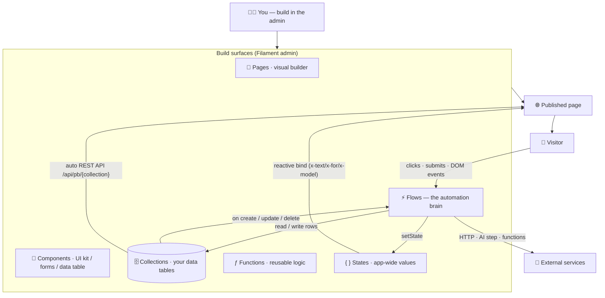

# Synapse — App Builder

**Build real web apps visually — pages, data, automations and live UI — inside your own Laravel + Filament admin.** Drag components onto a page, define your own data tables, wire up automations that react to clicks and data changes, and bind components to live state. Everything runs on your server; nothing leaves your app.

> **Status: v1 (no-AI baseline).** This is the complete builder *without* the AI layer — saved as the private baseline before the AI-orchestration phase. Working name **Synapse — App Builder**; the Composer package is currently `andrecorugda/ai-page-builder` (renamed at public release).

---

## What is this? (the plain version)

Think of it as a **visual app builder you host yourself**, made of five pieces that click together:

- **Pages** — design pages by dragging blocks (a GrapesJS visual editor).
- **Components** — a UI kit: buttons, modals, drawers, tabs, forms, and a **data table** — like Material UI, but drag-and-drop.
- **Collections** — define your own data (e.g. *Leads*, *Orders*); each becomes a real database table with an instant REST API and an admin to browse rows.
- **Flows** — the "brain": automations on a visual canvas. *When a button is clicked / a record is created → do these steps.*
- **States** — app-wide values (e.g. a cart total) that components bind to and **update live**, like a front-end store.

Put together: a visitor clicks a button → a **flow** runs → it reads/writes a **collection** and sets a **state** → bound **components** re-render instantly. No page reload, no separate front-end app.

### What you can build
- A lead-capture site whose form writes straight into a *Leads* collection.
- An internal dashboard with a filterable **data table** of records.
- A small CRUD app: define a collection, drop a form + a table, wire a flow — done.
- Any marketing site, with reactive widgets driven by your own data.

---

## How it fits together



**The loop in one line:** *event → flow → read/write data + set state → bound components re-render.*

---

## The pieces in detail

| Piece | What it does |
|---|---|
| **Pages & visual builder** | GrapesJS editor with section blocks + primitives, responsive devices, animations, per-page custom CSS **and** custom JS, SEO meta, duplicate, publish → cached front-end route. |
| **Component library** | *UI kit:* card, banner, modal, drawer, tabs, accordion, tooltip, dropdown menu. *Forms:* text/email/textarea/select/checkbox/radio + submit, and a Form container that **creates a record or runs a flow** on submit. *Data:* a **Data Table** (fetches a collection over REST and renders rows) and a **List/Repeater**. |
| **Collections (data)** | Define a model and its fields → a **real database table** (`pb_<key>`), Directus-style. Typed fields, schema sync, an auto **REST API** (`/api/pb/{model}` with filter/sort/search/paginate), and a **records browser** (Fields │ Records tabs, with a scoped query panel). |
| **Flows (automation)** | A visual node canvas (dark, fullscreen). Nodes: Trigger, AI Invoke, HTTP Request, Function, **Collection CRUD**, Condition, **Set State**, Result actions. Triggers: a component DOM event, a **collection event** (create/update/delete + criteria), cron, or a public API call. Every run is recorded. |
| **Functions** | Reusable logic callable from a flow: a sandboxed **expression**, a registered **callable**, or **raw PHP** (gated). Edited in an Ace editor with linting; can read app **State**. |
| **States** | Persistent, app-wide key→value store (typed). Read as `{{ states.x }}` in flows, `state('x')` in expressions, `$states['x']` in PHP — and seeds a **reactive page store** that components bind to. |
| **Data binding** | Components bind to State on the published page via Alpine directives (`x-text`, `x-show`, `x-model`, `x-for`); flows push updates with `setState` and the UI re-renders live. |

---

## Quick start

### Requirements
- PHP 8.2+
- Laravel 11, 12, or 13
- Filament 4 or 5 (for the admin UI)

### Install
```bash
composer require andrecorugda/ai-page-builder
php artisan vendor:publish --tag="ai-page-builder-migrations"
php artisan migrate
```

Register the plugin on your Filament panel:
```php
use Andre\AiPageBuilder\Filament\AiPageBuilderPlugin;

public function panel(Panel $panel): Panel
{
    return $panel->plugin(AiPageBuilderPlugin::make());
}
```

A **Content** group appears in the admin with **Pages**, **Media**, **Flows**, **Functions**, **Collections** and **States**. Create a collection, build a page, drop a form/table, wire a flow, publish.

### Configuration (optional)
```bash
php artisan vendor:publish --tag="ai-page-builder-config"
```

---

## How it works (for developers)

- **`Page`** stores the canonical GrapesJS `project_data` + a compiled `html`/`css` snapshot + SEO `meta`; served at `/{prefix}/{slug}` (cached), or render `Page->html`/`css` from your own routing (`config('ai-page-builder.routes.render_enabled')`).
- **Collections** = `PbModel`/`PbField` metadata → `SchemaSynchronizer` creates/maintains the real `pb_<key>` table; a dynamic `Record` Eloquent model binds to it; **`RecordQuery`** is the single source of truth (Directus-style filtering + validation + column whitelisting) behind the REST API, the flow Collection node, and the Filament records browser.
- **Flows** = a `definition` graph (`{start, nodes}`) run by `FlowRunner`/`FlowManager`; node handlers live in `src/Flow/Nodes`; `FlowDispatcher` + a `RecordObserver` fire `collection` triggers; results are recorded as `FlowRun`s.
- **States** = `Variable`/`VariableStore`; injected into the published page and seeded into an Alpine `$store.app` on `alpine:init`.
- **Components** = blocks in `BlockVocabulary` (Sections · Basic · Shapes · Components · Forms · Data); overlays/forms/tables use Alpine directives that run on the published page (Alpine is shipped/vendored).
- **Front-end libraries** (GrapesJS, Drawflow, Ace, Alpine) load from a CDN by default and are **vendored** for offline self-hosting (below).

---

## Self-hosting front-end assets (offline / air-gapped)

By default the editor loads GrapesJS, Drawflow, Alpine and Ace from public CDNs, so a fresh install works with zero config. For offline, air-gapped, or strict-CSP deployments, the package bundles vendored copies:

```bash
php artisan vendor:publish --tag="ai-page-builder-assets"
# → public/vendor/ai-page-builder/{grapesjs,drawflow,alpine,ace}/
```

Then point the asset URLs at the published copies via env:
```dotenv
AI_PAGE_BUILDER_GRAPESJS_JS="/vendor/ai-page-builder/grapesjs/grapes.min.js"
AI_PAGE_BUILDER_GRAPESJS_CSS="/vendor/ai-page-builder/grapesjs/grapes.min.css"
AI_PAGE_BUILDER_DRAWFLOW_JS="/vendor/ai-page-builder/drawflow/drawflow.min.js"
AI_PAGE_BUILDER_DRAWFLOW_CSS="/vendor/ai-page-builder/drawflow/drawflow.min.css"
AI_PAGE_BUILDER_ALPINE_JS="/vendor/ai-page-builder/alpine/cdn.min.js"
AI_PAGE_BUILDER_ACE_BASE="/vendor/ai-page-builder/ace"
```

`AI_PAGE_BUILDER_ACE_BASE` must stay a **directory** — Ace appends `/ace.js` and lazy-loads its `mode-*`/`theme-*` files relative to it. Re-run the publish with `--force` after upgrading. Leaving the vars unset keeps the CDN defaults.

---

## What's next (the AI layer)

This baseline is intentionally **AI-free**. The next phase wires AI *on top* — generating collections, flows, functions and UI from a description, and binding data — with human-in-the-loop approval, metered through an OpenRouter gateway, via the flow's existing **AI Invoke** node. (When AI generates HTML, it passes through a sanitizer that allows the declarative binding directives but strips executable ones — owner-authored components are unaffected.)

## Testing
```bash
composer test
```

## License
MIT. See [LICENSE](LICENSE).
