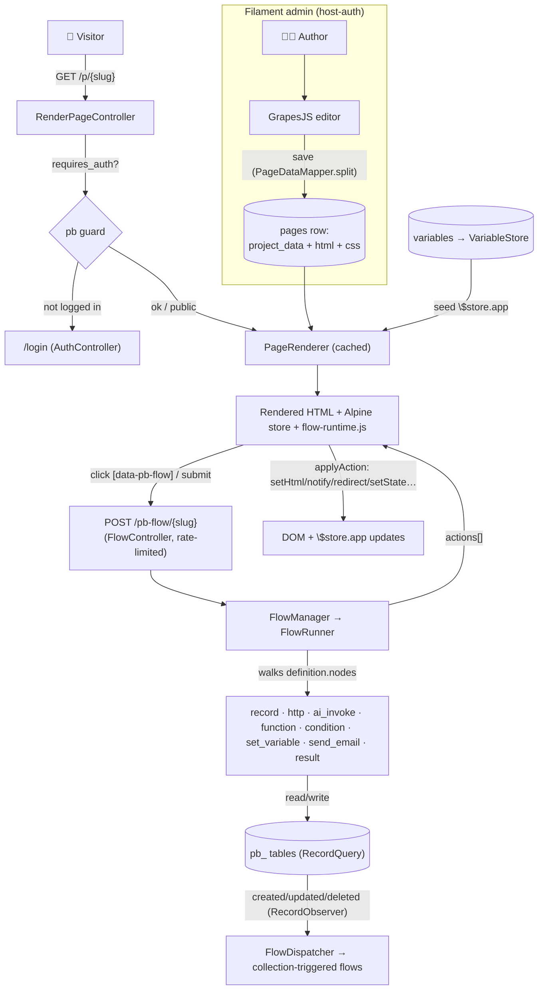
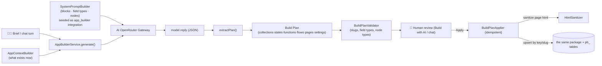

# Architecture

[← Docs index](README.md)

Synapse is seven cooperating subsystems behind one idea: **everything you build is data.** A page, a data table, an automation, a function, a state, a user, a permission — each is a row in a package table (or, for collections, a row plus a generated physical table). Nothing is compiled to files; the visual editor, the REST API, the flow engine and the AI applier all read and write the same rows through the same services. That is what makes AI generation safe and idempotent: the AI just produces a plan that the applier writes through the ordinary services, so an AI-built artifact is indistinguishable from a hand-built one.

## The seven pillars

| Pillar | Stored as | Built/edited via | Read at runtime by |
|---|---|---|---|
| **Pages & components** | `pages` rows (GrapesJS `project_data` + compiled `html`/`css`) | `PageResource` + GrapesJS field | `PageRenderer` → render route |
| **Collections (data)** | `page_builder_models` + `page_builder_fields` metadata → generated `pb_<key>` table | `PbModelResource` + `SchemaSynchronizer` | REST API, Flows, Functions, pages |
| **Flows** | `page_builder_flows` rows (a `definition` graph) | `FlowResource` + Drawflow canvas | `FlowRunner` / `FlowManager` |
| **Functions** | `page_builder_functions` rows | `FunctionResource` | `FunctionNode` via `FunctionRegistry` |
| **States** | `page_builder_variables` rows | `VariableResource` | `VariableStore` → Alpine `$store.app` |
| **Auth & permissions** | `page_builder_users` / `_roles` / `_permissions` rows | `PbUser`/`PbRole` resources | `pb` guard + `AccessControl` |
| **AI generation** | nothing of its own — emits a Build Plan | *Build with AI* page + floating chat | `AppBuilderService` → `BuildPlanApplier` |

## Key services (`src/Services` + `src/Flow` + `src/Ai`)

All registered in `AiPageBuilderServiceProvider`:

- **`PageRenderer`** — assembles and caches the final HTML for a published page.
- **`SchemaSynchronizer`** (`Services\Data`) — turns a `PbModel` + its fields into a real `pb_<key>` table; alters it as fields change.
- **`RecordQuery`** (`Services\Data`) — the single CRUD + query gateway for collection records (used by the API, flows, functions, the AI applier and Filament alike).
- **`VariableStore`** (`Services\Data`) — read/write persistent States.
- **`Settings`** — key/value builder settings (home page, SMTP), with encrypted values for secrets.
- **`AccessControl`** — the opt-in permission engine for the built app's end-users.
- **`MediaLibrary`** — uploads + GrapesJS asset list.
- **`PageBuilderMailer`** — an isolated SMTP transport (never the host mailer).
- **`FlowRunner` / `FlowManager` / `FlowDispatcher` / `NodeRegistry`** — the automation engine.
- **`AppBuilderService` / `BuildPlanValidator` / `BuildPlanApplier` / `HtmlSanitizer`** — the AI layer.

## Request lifecycle — a published page + a flow

**The loop in one line:** *event → flow → read/write data + set state → bound components re-render.*

## AI lifecycle — describe → plan → apply

The AI never writes files or runs code. It produces a **Build Plan** (a typed JSON object); a validator checks it; a human approves; the applier writes it through the same services everything else uses.

Because the applier upserts by `key`/`slug`, **refining** an app is just re-applying a plan that references existing items — the floating chat threads the conversation so the model keeps context across turns. See [AI](ai.md).

## "Everything is data" — why it matters

- **Portability** — an app is a set of rows; export/import is a DB concern, not a file-sync concern.
- **Uniformity** — the REST API, flows, functions, the admin and the AI applier all go through `RecordQuery` / the model services, so validation and permissions apply everywhere identically.
- **Safe AI** — the AI's only output is a validated plan; it cannot inject files or execute code, and its HTML is sanitized before storage.
- **Idempotence** — re-running anything (a plan, a sync) converges to the same state.

## Routes registered by the package

Registered in `packageBooted()` of the service provider; all prefixes/middleware are config-driven (see [Configuration](configuration.md)).

| Purpose | Method + path (defaults) | Controller |
|---|---|---|
| Render published page | `GET /p/{slug}` | `RenderPageController` |
| Render home page | `GET /p/` (and optionally `GET /`) | `RenderPageController@home` |
| Login / logout / me | `GET\|POST /login`, `POST /pb-logout`, `GET /pb-auth/me` | `AuthController` |
| Data REST API | `GET\|POST\|PATCH\|DELETE /api/pb/{model}[/{id}]` | `RecordApiController` |
| Public flow run | `POST /pb-flow/{slug}` | `FlowController` |
| Media upload (panel) | `POST /ai-page-builder/media/upload` | `MediaController` |
| PHP lint (panel) | `POST /ai-page-builder/lint/php` | `CodeLintController` |
| AI chat (panel) | `POST /ai-page-builder/ai-chat`, `/ai-chat/apply` | `AiChatController` |

Next: [Pages & components](pages-and-components.md).
